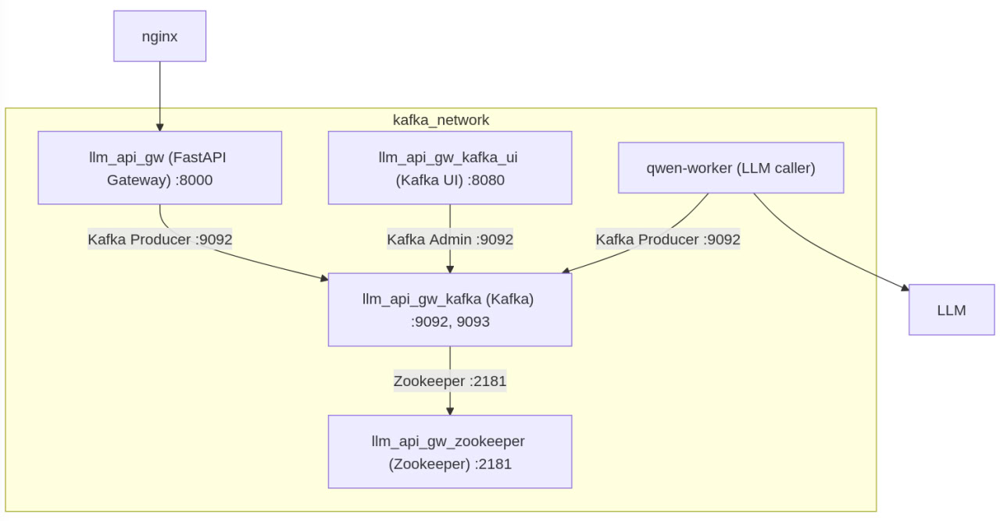

# OpenAI compatible FastAPI server with Kafka

This is FastAPI application with LLM worked daemon running separately.

Services are communicating via Kafka messaging bus.


## Author

Author: Alexey Suponin <lexxsmith@gmail.com>

## Version

0.1.0

## License

License: MIT

## Quick start

```
python3.10 -m venv venv
source venv/bin/activate
pip install pip-tools
make deps

mv .env.example .env
```

Now write your base url, token, model into `.env`

#### Run full stack

Run `docker-compose up -d --build`


#### Local development

If you want to run FastAPI locally, comment the `main` service in `docker-compose.yml`

Run `docker-compose up -d --build`
Start dev server `uvicorn --host 0.0.0.0 --port 8000 --reload app.main:application`

## Kafka

UI is accessible on http://127.0.0.1:8080/


## SwaggerUI

Visit the http://127.0.0.1:8000/docs

You can call `/completions` and `/chat/completions` with sync or stream method.

## OpenAI compatibility

With running FastAPI server, you can set openai client and test it like ChatGPT

```python
from openai import OpenAI, AsyncOpenAI

base_url = 'http://127.0.0.1:8000/v1'

client = OpenAI(api_key='token', base_url=base_url)
async_client = AsyncOpenAI(api_key='token', base_url=base_url)

def test():
    chat_request = {
        'model': 'Qwen/Qwen2.5-72B-Instruct-AWQ',
        'messages': [
            {'role': 'system', 'content': 'Ты помощник.'},
            {'role': 'user', 'content': 'Привет, как дела?'},
        ],
        'temperature': 0.7,
        'stream': False,
    }
    response = client.chat.completions.create(**chat_request)
    print(response)

test()
```

There are more example in [test.py](test.py)


## Production and scalability

The following is the production architecture  

### Services

#### Nginx

Service as your gateway from global network to the in-house services

#### llm_api_gw

FastAPI main application, receiving requests by `/api/v1/completions` and `/api/v1/chat/completions` and sending them to LLM workers via Kafka

#### llm_api_gw_kafka_ui

Internal UI for administration and debugging. You can view messages and topics from that UI.

#### llm_api_gw_kafka

Kafka messaging bus.

#### llm_api_gw_kafka_zookeeper

Kafka configuration service

#### qwen-worker

Worker, which receives messages from Kafka and send them to LLM host.
Scalable and bounded to consumer group.

### How-To-Scale.

In case you have 2 or more LLM models and want to incoming requests to be routed to exact LLM host, you just need to 

#### Set additional worker to docker-compose ( here we have 1 in-house model and 2 as chat gpt global ) 

```yaml
  qwen-worker:
    build:
      context: .
      dockerfile: app/agent/Dockerfile
    depends_on:
      kafka:
        condition: service_healthy
    environment:
      OPENAI_TOKEN: "${FIRST_OPENAI_TOKEN}"
      OPENAI_MODEL_NAME: "${FIRST_OPENAI_MODEL_NAME}"
      OPENAI_HOST: "${FIRST_OPENAI_HOST}"
      KAFKA_REQUEST_TOPIC: "chat_requests_generic"
      KAFKA_RESPONSE_TOPIC: "chat_responses_generic"
      BOOTSTRAP_SERVERS: kafka:9092
      GROUP_ID: "qwen2_5"
    deploy:
      mode: replicated
      replicas: 1
    networks:
      kafka_network:

  chatgpt-worker:
    build:
      context: .
      dockerfile: app/agent/Dockerfile
    depends_on:
      kafka:
        condition: service_healthy
    environment:
      OPENAI_TOKEN: "${SECOND_OPENAI_TOKEN}"
      OPENAI_MODEL_NAME: "${SECOND_OPENAI_MODEL_NAME}"
      OPENAI_HOST: "${SECOND_OPENAI_HOST}"
      KAFKA_REQUEST_TOPIC: "chat_requests_generic"
      KAFKA_RESPONSE_TOPIC: "chat_responses_generic"
      BOOTSTRAP_SERVERS: kafka:9092
      GROUP_ID: "gpt-4"
    networks:
      kafka_network:
    deploy:
      mode: replicated
      replicas: 1
```

#### Extend your .env file 

```
# Models and specifications
FIRST_OPENAI_TOKEN=token
FIRST_OPENAI_MODEL_NAME=Qwen/Qwen2.5-72B-Instruct-AWQ
FIRST_OPENAI_HOST=http://localhost:8000/v1

SECOND_OPENAI_TOKEN=secret
SECOND_OPENAI_MODEL_NAME=gpt-4
SECOND_OPENAI_HOST=https://api.openai.com/v1
BOOTSTRAP_SERVERS=localhost:9093
```

With that you will have 2 docker containers, processing requests to models `Qwen` and `gpt-4` by separate services.

#### Replication

In order to have more workers for call LLM, just increase `replicas: 1` number and there will be more services for operation with exact model.

#### Separate deployment

Usually Kafka and Gateway services are separated and you don't need to run shutdown+deployment of Kafka every code changes.

For that case there is [docker-compose.k8s.yml](docker-compose.k8s.yml) and [docker-compose.llm.yml](docker-compose.llm.yml) files.

First one will bring up your Kafka. Maybe in K8S or physical nodes.

Second will bring up your LLM workers and FastAPI gateway, so that you can set them up near your LLM, connecting by internal network.

Don't forget to set `BOOTSTRAP_SERVERS` in `.env` for FastAPI gateway services.

##### Basic routine:

Running one time deployment of Kafka

```
docker compose -f docker-compose.k8s.yml up -d
```

Running deployment of LLM workers on CI/CD on code changes

```
docker compose -f docker-compose.llm.yml up -d --build
```
